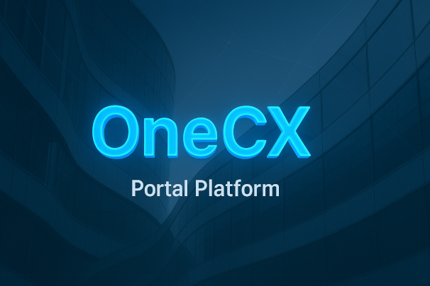

  

<h1 align="center">👋 Welcome to OneCX</h1>

  🚀 The open-source portal platform for modern web and software development. 

### 🌟 About us

We are a technology-driven organization focused on creating scalable and efficient solution 
for digital manufacturing and software industrialization.
Our goal is to bridge the gap between **industrial operations** and **modern digital platforms**, empowering companies to innovate faster and smarter.

### 📂 Featured Projects

| Project | Description | Tech Stack |
|----------|--------------|-------------|
| [**onecx-documentation**](https://github.com/onecx/onecx-services) | 
| Modular microservices for OneCX | Quarkus, Angular, Kubernetes |
| [**onecx-local-env**](https://github.com/onecx/onecx-local-env) | 
| Local Environment for Developers | Java, Spring Boot, Angular |
| [**onecx-local-env-cli**](https://github.com/onecx/onecx-cli) | Developer CLI
| for automation and setup | Node.js, TypeScript |
